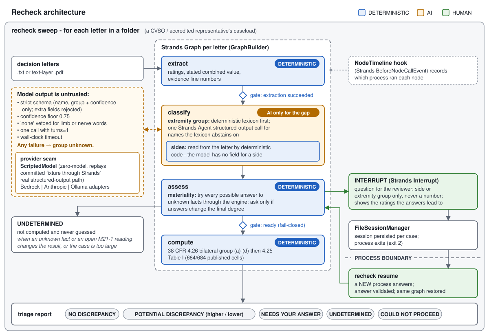

# Recheck

**A caseload agent for veterans' representatives. It re-checks the combined rating in every .txt or .pdf VA decision letter in a folder, finishes what the letters themselves settle, and brings back only the questions whose answer would change a rating.**

Built with the [Strands Agents SDK](https://strandsagents.com) for the AWS *Agents for Humans* hackathon · Track: **Professional Agents** · Demo video: *link added at submission* · MIT licensed



---

## The problem, in plain terms

A veteran with several service-connected disabilities does not get their percentages added up. VA combines them under **38 CFR 4.25**: each disability takes a share of what the previous ones left, so 60% and 20% make 68%, which becomes a final 70%.

One extra rule is easy to get wrong. Under **38 CFR 4.26**, when disabilities affect *both* arms or *both* legs, all of those ratings are combined first and **10% of that value is added** — the *bilateral factor* — before anything else. Which disabilities belong in it can move the final rating by 10 points, and with it the monthly payment.

The people who catch this are **County Veterans Service Officers and accredited representatives**, reviewing stacks of decision letters for the veterans they represent. Recheck is built for them.

### Is this a real problem?

VA itself treats it as one. No public source says how often it happens — VA publishes only overall accuracy rates — so Recheck makes no frequency claim. What the record does show:

- **VA's quality reviewers check for it by name.** The national rating quality-review checklist in VA's M21-5 manual carries the error code *"C2c-Misapplication of the bilateral factor"* ([M21-5, 3.B.7.a](https://www.knowva.ebenefits.va.gov/system/ws/v11/ss/article/554400000141318?portalId=554400000001018&usertype=customer&$lang=en-US&$attribute=content)), and the archived decision-review checklist lists *"The bilateral factor was improperly applied or not applied when required"* ([M21-5, 3.A.12.a, archived](https://www.knowva.ebenefits.va.gov/system/ws/v11/ss/article/554400000127658?portalId=554400000001018&usertype=customer&$lang=en-US&$attribute=content)).
- **It happens in exactly the shape Recheck checks.** In December 2025 the Board of Veterans' Appeals found that VA *"improperly calculated the bilateral factor"*: a third lower-extremity rating had been left out of the bilateral group, and the combined rating went from 40% to 50% ([BVA A25111179](https://www.va.gov/vetapp25/Files12/A25111179.txt), non-precedential).
- **Which disabilities belong is contested even inside VA.** In another December 2025 decision VA had removed a bilateral factor as a "clear and unmistakable error"; the Board found no error and ordered it restored ([BVA A25108403](https://www.va.gov/vetapp25/Files12/A25108403.txt), non-precedential). That is why Recheck surfaces differences rather than adjudicating them.
- **The rule changed recently.** 4.26(d), which removes disabilities from the factor when that is more favourable, took effect **April 16, 2023** ([88 FR 22914](https://www.govinfo.gov/content/pkg/FR-2023-04-14/html/2023-07426.htm)); VA stated that *"previous evaluations using the prior bilateral factor rule were not in error"* ([88 FR 89307](https://www.govinfo.gov/content/pkg/FR-2023-12-27/html/2023-28241.htm)).

The veteran receives the narrative section of a rating decision; the code sheet, where VA records bilateral factors, *"is intended for internal processing and should not be routinely distributed to the claimant"* ([M21-1 V.iv.1.D.1.d](https://www.knowva.ebenefits.va.gov/system/ws/v11/ss/article/554400000180526?portalId=554400000001018&usertype=customer&$lang=en-US&$attribute=content)). Representatives can receive it; Recheck works from the narrative letter.

## What Recheck does

```text
recheck sweep <folder of decision letters>
```

For each letter, unattended:

1. **Reads the evaluations** — percentages, the stated combined rating, and the line each came from. *(deterministic)*
2. **Works out which disabilities are of an arm or a leg.** The rating schedule's own anatomy (knee, sciatic nerve, humerus, pes planus…) is recognised by a deterministic lexicon. Clinical and eponymous names outside that vocabulary ("cubital tunnel syndrome", "De Quervain's tenosynovitis") go to a model in **one** structured call per letter. *(AI only for the gap)*
3. **Reads which side each is on** from the letter's own words. The model is never asked. *(deterministic)*
4. **Decides whether anything unknown matters.** If the letter omits a fact, Recheck runs every possible answer through the rating engine. If they all give the same rating, nobody is asked. If there are too many possibilities to try them all, the letter is UNDETERMINED rather than guessed. *(deterministic)*
5. **Asks a person only when an answer would change the rating** — a side or an extremity group, never a number — and shows the ratings the answers lead to. The question is persisted and the process exits; the representative answers later, from any process. *(human)*
6. **Applies 4.26 and 4.25** and compares with the letter. *(deterministic)*

Real output, from the committed synthetic caseload (progress and rule lines not shown; `...` marks rows left out):

```text
CASELOAD TRIAGE  -  24 document(s)

  NO DISCREPANCY FOUND                                                  13

  POTENTIAL DISCREPANCY - review recommended                             8
     questions to raise in review, not findings of error
     recomputed HIGHER than the letter
       case_002     stated 80%   recomputed 90%   (+10, 4.26 applied)
       ...
     recomputed LOWER than the letter - raising it could prompt a downward review
       case_015     stated 70%   recomputed 60%   (-10, 4.26 not applied)

  NEEDS YOUR ANSWER                                                      3
     case_012     could be 60% or 70%; letter states 60%
       [1] limitation of flexion of the knee            side?
       [2] plantar fasciitis                            side?
       recheck resume --case case_012 --answer "1=<left|right|both|unknown>,2=<left|right|both|unknown>"
     ...
     case_019     could be 60% or 70%; letter states 60%
       [2] left Lisfranc injury                         extremity group?
       recheck resume --case case_019 --answer "2=<upper|lower|none|unknown>"

  UNDETERMINED - not computed                                            0

  COULD NOT PROCEED                                                      0

24 documents: 13 no discrepancy, 8 to review, 3 waiting on an answer, 0 undetermined, 0 could not proceed
questions asked: 3.  letters with unknown facts that could not change the rating, so nobody was asked: 1
extremity groups: 73 lexicon, 8 AI, 0 reviewer, 1 unknown.  sides read from the letters: 41.  arithmetic: all deterministic
```

The letters and their mix are synthetic and chosen by `tools/make_caseload.py`; the counts show the routing, not a real-world error rate. The sweep was run with `--scripted`, and prints a zero-model notice above the triage (not shown): the 8 AI groups above are replayed from `fixtures/classifications/caseload.json`, which maps three clinical terms (cubital tunnel, lateral epicondylitis, de Quervain) to a group. No model was called.

A difference is reported as **POTENTIAL DISCREPANCY — HUMAN REVIEW RECOMMENDED**, never as "VA is wrong". A result that depends on a fact nobody established is **UNDETERMINED**, with the ratings it could be when they can all be tried — never a guess, and never "no discrepancy".

## Why this is an agent and not a calculator

Rating calculators exist. What a representative lacks is something that works through the stack without them and interrupts only when their judgment is needed.

- **It works unattended.** `sweep` audits a folder unattended. Running it again reports each case as it stands, so the sweep is also the caseload's status view.
- **It decides when a person is needed — deterministically.** Materiality separates "the letter didn't say which knee" (usually irrelevant) from "the letter didn't say which knee, and that decides between 60% and 70%".
- **Its questions survive the process.** Each letter is its own Strands graph with its own persisted session. A question raised on Monday is answered on Wednesday by a different process, and the report shows which process ran each step.
- **The model is confined to one judgment**, and nothing it says is used unchecked.

## Who decides what

| Fact or step | Decided by | Guard |
|---|---|---|
| Percentages, stated combined rating, evidence lines | deterministic parser | refuses rather than reading part of a letter: a percentage in the decision section it cannot tie to a rating or the combined statement, a numbered list with a gap or a wrapped row, a condition rated twice in prose sentences (repeated numbered table rows are kept as separate ratings), two different current combined figures, a rating after a mid-list heading, a value over 100%, a condition name carrying letterhead or salutation text |
| Extremity group, rating-schedule vocabulary | deterministic lexicon | abstains rather than guessing; 0 wrong assertions on both measured name sets |
| Extremity group, other names | **AI** — one Strands Agent structured-output call per letter | strict schema: the name echoed back, a group and a confidence only (no side, number or free text). Extra fields, wrong types, a second answer or a repeated key discard the output. Confidence floor 0.75. "none" vetoed for limb or nerve vocabulary and for letters outside Latin-1. `turns=1`, and the Strands Agent's own retry is off. Wall-clock timeout, with the call on its own thread. At most 40 names per call; a name carrying a percentage, label, date or long number is not sent. Any failure leaves the group **unknown** |
| Side (left / right / both) | deterministic, from the letter's words | handedness and linked conditions ("secondary to right knee") are not the rated side; "both" only from wording that names both sides, and two conflicting side words leave the side unknown |
| Whether a person is needed | deterministic materiality check | every possible answer run through the engine, up to 4,096 combinations within a fixed work budget; beyond that the result is UNDETERMINED, never sampled |
| A missing side or group | **human** reviewer | asked only when it changes the rating (never about a 0% evaluation, which 4.26(c) keeps out of the factor); facts only; a stated fact cannot be overridden; a rejected answer re-opens the question; a partial answer ("lower") brings a follow-up for what is still missing |
| 4.26 bilateral factor, 4.25 Table I, final degree | deterministic engine | 684/684 published Table I cells; the regulations' worked examples; published Board and Federal Register calculations; an independent reading of 4.26 |
| Verdict wording | deterministic | never asserts error; a lower recomputation carries a caution |

## Quick start

Python 3.10 or later. No AWS account, no API key, no network.

```bash
git clone <repository URL> recheck && cd recheck
python -m venv .venv
# Windows cmd/PowerShell: .venv\Scripts\activate    Git Bash: source .venv/Scripts/activate    macOS/Linux: source .venv/bin/activate
# (PowerShell refusing to run the script: Set-ExecutionPolicy -Scope Process Bypass, then activate)
pip install -e ".[dev]"

python tools/demo.py          # the whole story, zero cost (33 s to 3 min on the Windows test machine, depending on load)
```

Or drive it yourself:

```bash
# sweep a caseload
recheck sweep fixtures/caseload --scripted --classifications fixtures/classifications/caseload.json

# answer a question the sweep raised - a separate process
recheck resume --case case_019 --answer "2=lower"

# one letter with the full decision trace
recheck audit fixtures/letters/07_clinical_terms.txt --case a --scripted --classifications fixtures/classifications/07_clinical_terms.json

# the same letter with no classifier: Recheck asks instead of guessing
recheck audit fixtures/letters/07_clinical_terms.txt --case b

recheck show --case a --brief
```

Exit codes: `0` finished · `2` waiting on an answer (including a follow-up after a partial answer) · `3` no result (unreadable, undetermined, rejected answer, a case that cannot be trusted or whose letter has changed, a case busy in another process, a malformed command). `show` exits `0` whenever it prints a case as it stands, whatever its status, and `3` when the case cannot be used as shown (corrupt, its letter changed, or its question lost). `--fresh` re-audits an existing case and discards its reviewer answers; a sweep says for how many cases `--fresh` would discard answers, and afterwards names them.

A resume that fails part-way (a file another program holds, Ctrl+C) puts the case and its question back as they were. A case whose answers were accepted before its arithmetic ran is finished with `recheck resume --case ID` and no `--answer`. A sweep never deletes a case it cannot load unless you pass `--fresh`, and two letters whose file names differ only in letter case are refused rather than sharing one case.

### About `--scripted`

**No live model has been called in this repository's demo or tests.** `--scripted` replays a committed classification fixture *through Strands' real structured-output path* — a custom `Model` that emits the same tool-use events a provider does — so Recheck's validation, floor, veto and fail-closed routing all run for real. Every case report says in its header that AI decisions were replayed from a fixture and no model was called, and labels them `AI - replayed fixture` in its trace and evaluations table. A sweep prints a zero-model notice above its triage, where the counts say only "AI". A name the fixture does not list comes back at confidence 0 and is refused, as an uncertain model's answer would be. The caseload contains one such name on purpose ("Lisfranc injury").

## How it works

One Strands `Graph` per letter, built from four custom `MultiAgentBase` nodes:

```text
extract --(gate: extraction succeeded)--> classify --> assess --(gate: ready)--> compute
                                                         |
                                     would an answer change the rating?
                                                         |
                             Strands Interrupt -> FileSessionManager -> process exits (2)
                                                         |
                             recheck resume (new process) -> assess -> compute
```

| Strands feature | Where | Why it is there |
|---|---|---|
| `GraphBuilder`, custom `MultiAgentBase` nodes | `graph.py` | a per-letter state machine that can stop at `assess` and continue elsewhere |
| Conditional edges | `graph.py` | returning `FAILED` does not stop downstream nodes in this SDK version, so the gates are topology. They must also be *stable*: Strands re-evaluates them when it persists the session, and a condition that flips after its node runs empties the resume point |
| `Interrupt` returned from a custom node (`MultiAgentResult(status=INTERRUPTED)`) | `graph.py: AssessNode` | the reviewer's question, with its possible outcomes in the interrupt reason |
| `FileSessionManager` | `graph.py: build_graph` | the only store of graph state, restored as the graph is built. Resume, show and sweep accept a session only in the shape `assess` leaves it (one interrupt, raised by `assess` for this case, nothing else to re-run); resume puts the session and case file back if the resumed run fails |
| `HookProvider` on `BeforeNodeCallEvent` | `graph.py: NodeTimeline` | records which process ran each node, printed in every report |
| `Agent.stream_async(structured_output_model=…, limits={"turns": 1}, cancel_signal=…)`, on its own thread and event loop | `classify.py` | one bounded, validated classification call. The raw tool-use JSON is re-read, so a second answer or a repeated key discards the output, and an answer that arrives after the wall-clock budget is never used |
| Custom `Model` | `models/scripted.py` | the zero-cost path through the real structured-output machinery |
| Bedrock, Anthropic and Ollama model adapters | `models/factory.py` | a provider is an adapter at the edge, not a dependency |

Deliberately not used: agent tools (other than the structured-output tool Strands generates from the schema), Swarm, A2A, multi-agent delegation, RAG, long-term memory (the only persisted state is each letter's case file and graph session). The problem is one workflow per letter.

### Is the AI necessary?

Honestly: not proven. The rating schedule's vocabulary is finite, so the lexicon covers it — **113 of 138** schedule names resolved, 0 wrong (`python tools/gate_report.py`). On 66 letter-style clinical names written for this project (internal labels, disclosed), the schedule lexicon abstains on 35 of 47 arm and leg names with 0 wrong assertions — but an independent review showed a larger word list would cover much of that too. Recheck's position is a policy, not a proof: the schedule's vocabulary is deterministic; names outside it go to a classifier; and because the classifier is untrusted, a missing, invalid, contradictory, late, uncertain or unavailable answer costs at most a question, never a figure. A confident wrong group that passes the confidence floor and the veto *is* used. Every verdict that rests on one says so ("the AI classification of [i]"), and its triage row lists the AI groups.

## The rating engine

`src/recheck/cfr/` has no model calls, no network and no I/O; all arithmetic is `Decimal`.

- **Table I is rounded at every step.** 4.25(a) combines "the combined value, exactly as found in table I" with the next rating, and Table I cells are integers. The rounding mode was fitted against every published cell: half-up matches **684/684**; half-even misses 33; truncation 310. `python tools/fetch_cfr.py` re-extracts the table from the official eCFR API and diffs it with the committed fixture.
- **4.26 applies to every bilateral disability,** not one pair: all compensable left and right ratings of a qualifying pair of extremities are combined, 10% of that value is *added*, and the result is one disability; both arms and both legs form one group (4.26(b)); 4.26(d) is an exhaustive search over leaving out "one or more" disabilities when that is more favourable, for up to 12 arm and leg ratings (a letter with more is UNDETERMINED). A single evaluation covering both extremities (bilateral pes planus) joins the group when another compensable rating of the same pair exists, per M21-1 V.iv.1.C.4.b; the case M21-1 leaves open is reported UNDETERMINED if it matters.
- **Checked against numbers other people published:** the regulations' own worked examples; BVA Citation Nr 1312955 (five leg ratings in one group: 41 + 4.1 = 45, final 80%); BVA 0815809 (four extremities); BVA 1519449 (bilateral feet with both knees); VA's 4.26(d) example in 88 FR 22915 (93 and 21 → 90% under the prior rule; 100% now); and a deliberately naive, independently written reading of 4.26 over 3,360 rating combinations.

## Verification

- **1,800 tests**: 686 of them the Table I file (every published cell), 1,114 behavioural. Of those, 421 are the red team's regression tests (`tests/test_rt_*.py`) and 248 the deep review's (`tests/test_deep_*.py` and `tests/test_rc2_fixes.py`). `pytest` runs them in several minutes (4 to 8 on the Windows test machine while other runs loaded it).
- **Regression tests for every code defect fixed**, including those from an 8-lens hostile review, a test-suite review that mutation-tested the code (34 of 35 reintroduced defects caught; the survivor now has a test), an adversarial red team (53 findings, two rounds of fixes, then a final regression pass over where the fixes met), and a deep review of the release candidate in nine areas, with an independent verifier re-attacking the fixes in seven of them. Its mutation run broke safety checks 106 ways; the suite caught 97 of the 105 that change behaviour, and the 8 survivors now have tests. The defects, fixes, measurements and known residuals are written up in [docs/ENGINEERING.md](docs/ENGINEERING.md).
- **Hand-derived expectations** for eight caseload letters that each pin one behaviour (three leg disabilities, four extremities, a linked clause, an immaterial unknown, a material question, an unlisted term, a lower recomputation, clinical names with no side) — [fixtures/caseload/EXPECTED.md](fixtures/caseload/EXPECTED.md).
- **Clean clone:** before the deep review, install, the full suite, the demo and every command in this README were run from a fresh clone with an empty home directory and no credentials, on Python 3.12 and 3.10. On the final code, the full suite (1,798 passed, 2 skipped) and the demo were run again on Windows with Python 3.12 and 3.10, in installed environments. A few tests skip themselves: two Anthropic-adapter tests without the optional `anthropic` extra, three that need Windows, two that need a case-insensitive filesystem, and two path-length tests when the temporary directory is too deep for them.

## Limitations

- **Synthetic letters only.** Every letter in `fixtures/` was written for this project. No real veteran data is in the repository, and the parser has not met real VA correspondence.
- **Narrative letters, not the code sheet,** and no OCR: an image-only PDF is refused, and so is a scan whose OCR text is drawn in an invisible text mode over the image (a "searchable" scan). Text hidden other ways, such as under a full-page image, is not detected. A `.txt` letter must be UTF-8, or UTF-16 with a byte-order mark. `sweep` reads `.txt` and `.pdf` files directly inside the folder; other files and subfolders are not read or listed.
- **The parser fails closed, sometimes on ordinary wording.** Hard-wrapped all-caps prose, spaced dot leaders in a table (". . . ."), a year inside a condition name ("status post 2019 arthroscopy") or a percentage in an unrelated paragraph of the decision section make it refuse the letter rather than read it. A staged rating written under two different condition names, or as two numbered table rows (even with the same name and code), reads as two ratings. A linked condition in wording the parser does not list ("Hypertension, with right knee injury") can still give a name that limb and side.
- **No live model has been run.** The model boundary is exercised through the real Strands structured-output path with scripted payloads, including malformed and adversarial ones. No accuracy claim is made for any provider.
- **4.26 as currently in force.** Where 4.26(d) decides a result, the report says the exception took effect April 16, 2023; for a period before that date the prior rule applied the factor without exception. Recheck does not read the decision date.
- **Paired skeletal muscles** (4.26's third category) are not modelled.
- Not legal advice, not a VA adjudication, not a claims or appeals service.

## Model providers

The zero-model path is first-class; a provider is an adapter. `recheck preflight --model bedrock|anthropic|ollama` checks configuration **without an inference call**, in this order: provider known; model id set; the endpoint (Anthropic: an `ANTHROPIC_BASE_URL` override must be https or loopback; Bedrock: an override and the endpoint botocore resolves must both be the regional https AWS endpoint); provider SDK importable, and if it is not, nothing after it is checked; then for Bedrock a region and a resolvable AWS credential, for Anthropic `ANTHROPIC_API_KEY`, for Ollama `RECHECK_OLLAMA_HOST` parsing as scheme://host:port. The Ollama host is shown with any password masked, but it is not required to be https or local, so condition names sent to a remote http host travel unencrypted. Preflight reports how a credential resolves, never a credential value. `audit` and `sweep` call a provider only when run with `--model`. Only condition names, as the parser read them, are sent to a model: never a percentage, the stated rating, a date or a long number. Other text written inside a table row's name is sent with it. Every provider gets the time budget and the output cap (4,096 tokens by default; Ollama as `num_predict`), and the Strands Agent does not retry; the Bedrock and Anthropic clients also make a single attempt. Configuration is by environment variable; see [`.env.example`](.env.example).

## Repository layout

```text
src/recheck/
  cfr/combine.py            Table I arithmetic, bilateral subtotal, final degree
  cfr/rating.py             4.26(a)-(d) bilateral group and the derivation trace
  extract/deterministic.py  letter parser (fails closed) and the schedule-vocabulary lexicon
  extract/pdf_text.py       PDF text in a child process with a 20 s budget
  classify.py               extremity group (lexicon, then model) and side
  schema.py                 the strict schema for model output
  materiality.py            does an unknown fact change the rating?
  graph.py                  Strands graph, document caps, gates, interrupt, answer validation, timeline hook
  case.py                   durable case state (plain JSON, validated on load) and the per-case lock
  provenance.py             the decision trace: who decided what
  report.py, sweep.py       the report and the caseload triage
  cli.py                    sweep / audit / resume / show / preflight
  models/scripted.py        zero-model Strands Model
  models/factory.py         provider adapters and preflight
tools/     demo.py, gate_report.py, fetch_cfr.py, make_letters.py, make_caseload.py
fixtures/  letters, caseload (+ EXPECTED.md), classification fixtures, Table I cells, name sets
docs/      architecture.svg, ENGINEERING.md
```

## License

MIT — see [LICENSE](LICENSE).
